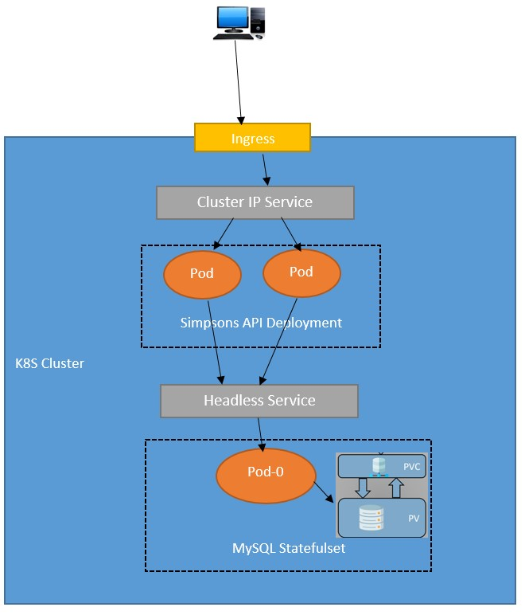

# Redbee Challenge - Simpsons Quotes API
 

## Pre-requisitos
* Minikube instalado y funcionando.
* Obtener la ip del cluster a través del siguiente comando (se utilizará en los siguientes pasos):
```bash
minikube ip
```
*Intalar addons ingress
```bash
minikube addons enable ingress
```

### Arquitectura a desplegar:
 

### Pasos:
1) Clonar este repositorio
```bash
git clone https://github.com/andresciccarelli/redbee.git
```
2) Posicionarse dentro de la carpeta Resources.
```bash
cd redbee/Resources/
```
3) Revisar la línea 10 del archivo Resources/simpsons-api-ingress.yaml con un editor de texto.
   
    \- host: simpsons.***192-168-49-2***.nip.io
   
   En caso de que la dirección ip de minikube sea diferente a 192.168.49.2, **reemplazar los octetos correspondientes, separados por guiones** y guardar los cambios.
   
4) Crear primero el namespace y luego los demás recursos:
```bash
kubectl create -f simpsons-namespace.yaml
```
```bash
kubectl create -f .
```

### Test de funcionamiento:

* Dentro de la misma PC, ingresar con un navegador a la dirección.
```bash
http://simpsons.192-168-49-2.nip.io/docs
```
En caso de haber reemplazado este dominio en el paso 3, ingresar la url correcta.
